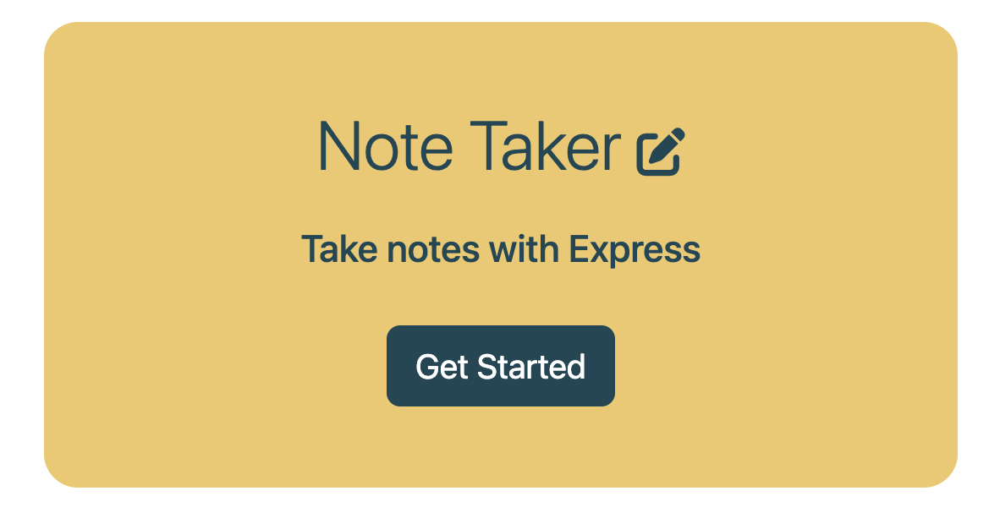

# Express Note Taker 

  

  ## Description

  This project was built to allow users to easily save and delete 'notes to self'. The UI for this project was very simple, with the backend functionality being the greater challenge. Using Express.js,  I created a server to handle the functionality of read, writing, and appending the user's notes to a 'notes database' to store them using JSON.stringify() to store the users notes and JSON.parse() to render the saved notes for the user. This project proved especially challenging for me, but by completing it I feel that I have a greater understanding of how servers work to send information between the front and back end.

  ## Table of Contents

  - [Installation](#installation)
  - [Usage](#usage)
  - [Credits](#credits)
  - [License](#license)

  ## Installation

  This application is deployed at https://note-worthy-notes.herokuapp.com/ and the code can be cloned at https://github.com/boushka9/note-worthy

  ## Usage

  Upon accessing the application via the deployed link above, users will be presented with the homepage. 

  

  From there, click the 'Get Started' button to write and save notes, access and view past notes, and delete notes that you no longer need.
  
  The main section of the notes page includes an area to enter a title and body of text for your notes, both of which need a text entry to save your note.
  
  

   Once you have enterd your note information, a save icon will apear in the top right hand corner, which can be clicked to save your note. 
   
   
   
   To view past saved notes, click on the desired note's title to view it in the main text area. 
   
   Then, to clear the main text area to write a new note to add, click the plus sign in the top right hand corner. 
   
   
   
   To delete a saved note, click on the orange trash can to the right of the saved note's title. 

   
   
   Finally, to return to the homepage, click 'Note Taker' at the top left hand corner of the page.

   

  ## Credits

  https://heynode.com/tutorial/readwrite-json-files-nodejs/ 
  
  https://tutorial.eyehunts.com/js/how-to-add-json-object-to-existing-json-array-in-javascript-example/ 
  
  https://www.geeksforgeeks.org/how-to-parse-json-object-using-json-stringify-in-javascript/?ref=rp 
  
  https://www.youtube.com/watch?v=pKd0Rpw7O48&ab_channel=ProgrammingwithMosh

  ## License

  This project is licensed under the terms of the MIT license 

  ---

  ## Badges

          

  ## How to Contribute

  N/A

  ## Tests

  N/A

  ## Questions

  If you have any questions regarding this application please contact me through email or GitHub:

  boushka9@gmail.com

  boushka9

  
